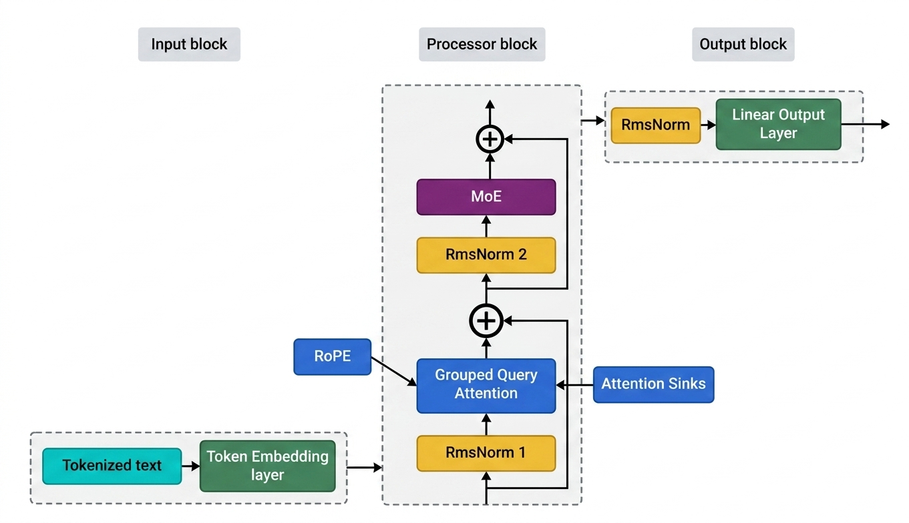

# gptoss

An open-source, from-scratch implementation of a modern Decoder-Only Transformer (Large Language Model) in PyTorch. Designed for learning and experimentation, `gptoss` incorporates many of the advanced architectural features found in state-of-the-art LLMs today.
## Architechture Diagram

## 🚀 Key Features

*   **Sparse Mixture-of-Experts (MoE) FFN**: Scalable model capacity using 32 experts with top-2 routing and an auxiliary load-balancing loss.
*   **Grouped Query Attention (GQA)**: Substantially reduces KV cache memory footprint and speeds up inference compared to standard Multi-Head Attention.
*   **Rotary Position Embeddings (RoPE)**: Context-aware relative positional encoding for robust sequence modeling.
*   **Native KV Caching**: Custom-built optimization spanning both Prompt Prefill and single-token Autoregressive Decode, automatically managed for rapid text generation.
*   **OpenAI Tiktoken Integration**: Defaults to the large `o200k_base` vocabulary natively.
*   **Optimized Training Loop**: Production-quality training script featuring gradient accumulation, PyTorch AMP (Mixed Precision with `bfloat16`/`float16`), Cosine Annealing Learning Rate scheduling, and `torch.compile` graph compilation for speedups.
*   **Built-in Metrics & Plotting**: Generates live, dark-themed Matplotlib graphs tracking Loss, Perplexity, Learning Rate, and Tokens/sec throughput during training.

## 🛠️ Getting Started

### Prerequisites

*   Python 3.8+
*   PyTorch 2.x+
*   `tiktoken`
*   `matplotlib` (for graph generation)

### 1. Data Preparation

First, tokenize and shard your dataset into memory-mapped `.npy` files.

```bash
python prepare_data.py
```

### 2. Training

Launch the training process. The script will automatically track metrics and save plots in the `artifacts/graphs/` directory, while preserving model weights in `checkpoints/`.

```bash
# Example training run with compilation
python train.py --batch_size 8 --max_steps 20000 --compile
```

Configuration variables such as model dimension, layer count, and MoE experts can be configured inside `config_model.py` or overridden via the CLI.

### 3. Inference / Generation

Generate text using the interactive script `predict.py`. It supports one-shot generation as well as an interactive REPL mode.

```bash
# One-shot command-line generation
python predict.py --prompt "Once upon a time" --temperature 0.8 --max_new_tokens 300 --top_k 50

# Interactive REPL mode
python predict.py
```

## 🏗️ Architecture Defaults

The default setup defined in `config_model.py`:
*   **Token Context Length**: 2048
*   **Embedding Dimension**: 1024
*   **Transformer Blocks**: 12 Layers
*   **Attention Heads**: 32 Query Heads, 8 KV Heads (GQA)
*   **MoE Structure**: 32 Experts, routing to the Top-2

---
*Built with PyTorch.*
